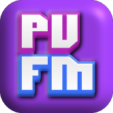

# PVFM Mobile-Friendly Web Player, PWA, & Mobile App

## Now available in the [Google Play Store!](https://play.google.com/store/apps/details?id=com.deltaryz.pvfm)

PonyvilleFM is an internet radio station featuring live DJ performances, album release events, and over a decade of "Brony" community music playing 24/7 across multiple stations. This app seeks to become the definitive way to experience PVFM, conveniently accessible right here from the Play Store, and online at [pvfm.deltaryz.com](https://pvfm.deltaryz.com)!

- Usable in browser, Progressive Web App, and Android app
- Stream from PonyvilleFM and PVFM "Free" (No DJs)
- Stream from Luna Radio
- Rich metadata with title, artist, albumart
- OS playback controls (notification, headphones, watches, speaker buttons)
- Volume slider
- Pausing the stream will resume from where you paused
- Multiple quality levels (MP3, OPUS, OGG, AAC)
- Upcoming events
- More coming soon!

[PonyvilleFM official website](https://ponyvillefm.com)

[Run this app in your browser!](https://pvfm.deltaryz.com)

[Google Play Store](https://play.google.com/store/apps/details?id=com.deltaryz.pvfm)